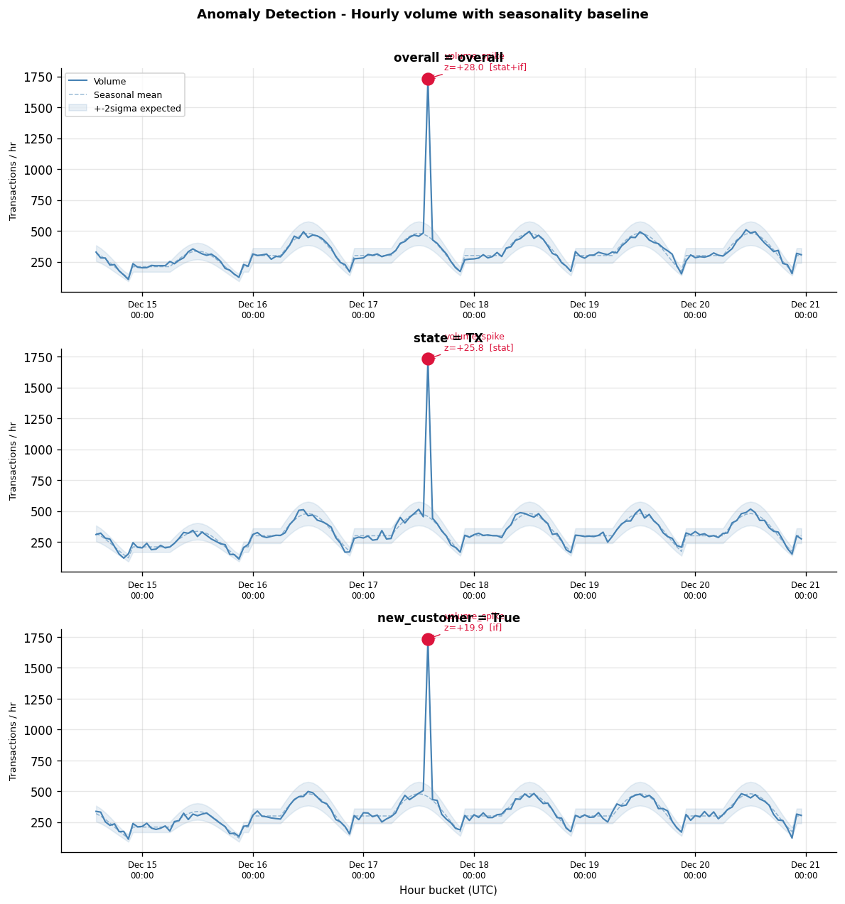

# Anomaly Detection Pipeline

Azure Functions pipeline for real-time transaction anomaly detection with automated weekly retraining.

## How It Works

Two timer-triggered functions run on independent schedules:

- **`anomaly_monitor`** runs hourly. It pulls the last 24 hours of live transactions, engineers features, scores them against pre-trained models, and sends a Teams alert if anomalies are found.
- **`retrain_pipeline`** runs every Sunday at 2:00 UTC. It pulls 90 days of historical data, retrains the models, and uploads the new artifacts to Blob Storage. The monitor picks them up on its next run.

---

## Detection Logic

Each run scores 5 independent dimension slices: `overall`, `state`, `product_type`, `transaction_status`, and `new_customer`. Every slice gets its own model and baseline.

Detection is two-layer — a point is flagged only if it clears either layer:

### Layer 1 — Statistical

Two signals are computed per hourly bucket:

**Volume z-score** — measures how unusual the transaction count is relative to the expected value for that specific `(hour_of_day, day_of_week)` combination. This avoids false positives during off-peak hours that would occur with a naive rolling mean.

**Velocity** — the hour-over-hour percentage change in volume. A large velocity spike (≥200% by default) triggers a flag even when the absolute volume isn't far from the baseline mean.

**Approval rate z-score** — for slices where approval rate is meaningful (overall, state, product type, new customer), a sudden drop in approval rate is scored as a separate signal.

A bucket is statistically flagged if its z-score exceeds the threshold (default: 3.0) or if velocity is high and volume is above the minimum.

### Layer 2 — Machine Learning

Each slice has an Isolation Forest (200 estimators) trained on the same hourly feature set: `volume_z_score`, `velocity_pct`, `hour_of_day`, `day_of_week`, and `approval_rate_z_score` where applicable.

The model assigns an anomaly score to every bucket. Points flagged as outliers (`prediction = -1`) that also cleared the statistical layer are surfaced as confirmed anomaly events.

---

## Seasonality Bias Prevention

A key design constraint: the live scoring window may itself contain the anomaly, so it cannot be used to compute its own baseline.

At retrain time, seasonal mean and standard deviation are computed from the clean 90-day training window and stored inside the model artifact. During hourly scoring, these pre-computed baselines are merged onto the live aggregates — the live window has no influence on the expected values it is being compared against.

If a scoring bucket has no matching `(group, hour, day_of_week)` entry in the stored baseline, it falls back to the cross-group `(hour, day_of_week)` stats, then to a global mean/std. Z-scores are never null.

---

## Notification

When anomalies are detected, a Teams Adaptive Card is posted containing:
- A summary header (count and severity)
- Per-slice fact tables with z-score, current value, expected value, and detection layer
- An inline chart image showing the volume time-series, seasonal mean ± 2σ band, and annotated anomaly markers for the top anomalous groups

The chart PNG is uploaded to Blob Storage with a short-lived SAS URL and referenced in the card. Teams cannot embed base64 images, so a publicly accessible URL is required.



---

## Seasonality Scope and Limitations

The current approach handles intra-week seasonality — it knows that Tuesday at 9am has a different expected volume than Saturday at 3am, and it learns these patterns from 90 days of history. This covers the primary source of false positives for a payment transaction pipeline.

What it does not model:

- **Annual cycles** — end-of-year spend surges, summer slowdowns, Q1 drop-off patterns
- **Holidays and payday effects** — Black Friday, federal holidays, month-end/payday volume lifts all produce legitimate spikes that the current model has no calendar awareness of
- **Multi-week drift** — gradual changes in baseline volume between Sunday retrains go undetected until the next artifact upload

For the v1 use case, the weekly retrain cycle and `(hour_of_day, day_of_week)` grouping are sufficient. Calendar effects are predictable enough that a well-tuned contamination threshold should absorb them without generating excessive false positives. This judgement should be revisited after 4–6 weeks of production signal.

If longer-term seasonality becomes a problem, the right approach is the LightGBM residual model described below — adding `is_holiday`, `is_month_end`, and multi-week lag features directly into the predictor rather than bolting calendar logic onto the z-score layer.

---

## V2 Enhancements

Improvements deferred from v1 pending production calibration. Revisit after 4–6 weeks of live data.

### V2.1 — LightGBM Residual Detection

Replace the statistical z-score layer with a LightGBM regression model that predicts expected volume per hour. The anomaly score becomes the standardized residual between the prediction and the actual observed value.

This is a meaningful accuracy step up because the model learns non-linear seasonal interactions (e.g., the Monday after a long weekend) and benefits from lag features — `lag_1h`, `lag_24h`, `lag_168h` — giving it genuine predictive power rather than just a bucket mean. It also enables more interpretable alerts: "volume was 340; model predicted 181 based on recent trends" vs. a raw z-score.

The v1 grouped z-score was chosen over LightGBM because: (1) it already addresses the core false positive problem without a trained model, (2) LightGBM hyperparameters are best tuned against real residual distributions rather than synthetic data, and (3) there is no production benchmark yet to validate the improvement. Because both approaches produce the same `expected_value` and `z_score` fields in `AnomalyEvent`, upgrading is a contained change — no impact on the notification, visualization, or scheduling layers.

Calendar features (`is_holiday`, `is_month_end`, `is_payday`) should be added at this stage as LightGBM inputs, addressing the long-term seasonality gap.

### V2.2 — Per-Segment Contamination Tuning

After 4–6 weeks of production data, review false positive and false negative rates per slice and adjust the `RETRAIN_CONTAMINATION` parameter per segment. High-volatility states or product types may need a looser threshold to avoid alert fatigue; low-volatility ones may benefit from tightening it.

### V2.3 — Anomaly Suppression Window

If a sustained anomalous period (e.g., a multi-hour spike) generates repeated identical alerts, add a lightweight suppression store — Azure Table Storage keyed by `(group_type, group_value, anomaly_type)` with a configurable TTL. Deferred from v1 because suppression during the initial calibration period could mask genuine detections and make the pipeline harder to evaluate.

---

## Project Structure

```
├── function_app.py             # Azure Functions entry point (timer triggers)
├── anomaly_monitor/
│   ├── detector.py             # Scoring + anomaly event generation
│   ├── features.py             # Live DB query + feature engineering
│   ├── notifier.py             # Teams Adaptive Card dispatch
│   └── visualizer.py          # PNG chart generation
├── retrain_pipeline/
│   ├── trainer.py              # Model training, evaluation, artifact upload
│   └── features.py             # Training DB query + feature engineering
├── shared/
│   ├── features.py             # Aggregation, velocity, z-score (shared)
│   ├── blob.py                 # Azure Blob Storage
│   ├── db.py                   # SQLAlchemy engine (live + training DB)
│   ├── config.py               # Environment variable accessors
│   └── logging_utils.py        # Structured logging with run_id injection
├── tests/                      # Unit tests (19 tests, no external dependencies)
└── notebooks/                  # End-to-end evaluation notebook + sample viz
```

## Local Setup

```bash
python -m venv .venv
.venv\Scripts\activate
pip install -r requirements.txt
pip install pytest
cp .env.example .env            # fill in connection strings
python -m pytest tests/ -v
```
